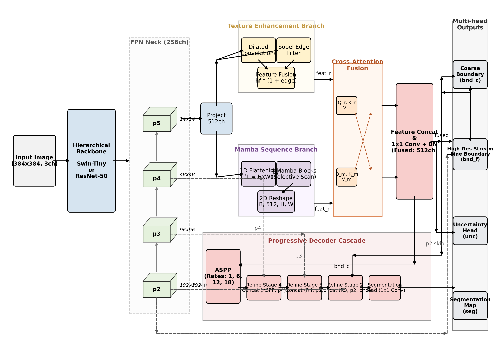

# Backbone First: A Controlled Architectural Comparison of CNN, Transformer, and Mamba Decoders for Camouflaged Object Detection

This repository contains the official codebase and results for the paper **"Backbone First: A Controlled Architectural Comparison of CNN, Transformer, and Mamba Decoders for Camouflaged Object Detection"**.

---

## Executive Summary & Core Findings

In camouflaged object detection (COD), models must segment hidden targets that blend into the background's color, texture, and edges. While recent works claim significant performance improvements from novel decoders (like Transformers or Mamba State Space Models), these comparisons are often confounded by simultaneous changes to backbones, loss functions, augmentations, and training schedules.

To address this, we present a **rigorous, controlled comparison** where all hyperparameters, optimizers, learning rate schedules, and loss formulations are kept identical. We isolate the contribution of two key variables:
1. **Decoder Choice:** Standard Vision Transformer vs. Mamba State Space Model.
2. **Backbone Choice:** Standard CNN (ResNet-50) vs. Hierarchical Transformer (Swin-Tiny).

### Key Takeaways
* **Backbone Dominates Decoder:** Upgrading the backbone from ResNet-50 to Swin-Tiny yields a **$0.0304$ S-measure ($S_m$) improvement**, which is roughly **six times larger** than the gain from swapping a Transformer decoder for a Mamba decoder ($0.0052$ $S_m$ gain) on a fixed ResNet-50 backbone.
* **Mamba holds the edge as a Decoder:** When holding the backbone constant, Mamba outperforms the Transformer decoder on structural accuracy ($S_m$), boundary precision ($wF_m$), and E-measure ($E_m$), while offering a faster wall-clock training time due to its linear complexity.
* **Evaluation Protocol Correction:** The metrics in this repository are evaluated strictly on the standard **2,026 camouflaged (CAM) images** of the COD10K test set using standard formulations (Margolin's CVPR 2014 for $wF_m$ and Fan's IJCAI 2018 for $E_m$), avoiding metric deflation caused by averaging empty negative control (NonCAM) images.

---

## Model Architecture

All configurations follow a unified pipeline: a backbone extracts multi-scale features, an FPN neck yields uniform $256$-channel feature maps ($p2, p3, p4, p5$), a sequence modeling branch processes the $p5$ features in parallel with a Texture Enhancement module ( Sobel edge map + convolutions), followed by cross-attention branch fusion and a Progressive Decoder with lateral connections.

Below is the detailed architectural schematic:



---

## Quantitative Results (COD10K Test Set)

All configurations were trained under matched conditions for 100 epochs on a single GPU node. Below are the corrected standard metrics evaluated strictly over the 2,026 camouflaged test images:

| Configuration / Model | $S_m$ $\uparrow$ | $E_m$ (mean) $\uparrow$ | $E_m$ (max) $\uparrow$ | $wF_m$ $\uparrow$ | MAE $\downarrow$ | Params |
| :--- | :---: | :---: | :---: | :---: | :---: | :---: |
| **ResNet + Transformer** | 0.8045 | 0.8348 | 0.9479 | 0.6268 | 0.0435 | **49.3M** |
| **ResNet + Mamba** | 0.8097 | 0.8387 | 0.9454 | 0.6408 | 0.0424 | 62.6M |
| **Swin + Mamba** (Ours) | **0.8401** | **0.8742** | **0.9496** | **0.6979** | **0.0341** | 67.2M |

---

## Repository Structure

```
├── cod_comparison/
│   ├── resnet_mamba/          # ResNet-50 + Mamba configuration and weights
│   ├── resnet_transformer/    # ResNet-50 + Transformer configuration
│   ├── swin_mamba/            # Swin-Tiny + Mamba configuration (best model)
│   └── shared/
│       ├── dataset.py         # COD10K PyTorch Dataset wrapper
│       ├── train.py           # Shared, controlled training script
│       ├── losses.py          # Multi-task composite loss function
│       └── metrics.py         # Corrected standard evaluation metrics class
├── main2fig/                  # Image assets for README
│   └── fig7_architecture_schematic.png
├── scratch/                   # Inference scripts and job submission helpers
│   ├── eval_cam_only.py       # Core evaluation script (CAM-only test set)
│   └── job_eval_cam_only.pbs  # PBS HPC job script for GPU evaluation
├── main.tex                   # LaTeX source of the paper
└── README.md                  # This file
```

---

## Usage Instructions

### 1. Requirements
Ensure you have the required packages installed:
```bash
pip install torch torchvision timm scipy matplotlib
```
*Optional but recommended for Mamba:* For maximum performance, install the native CUDA selective scan kernels:
```bash
pip install mamba-ssm causal-conv1d
```
If `mamba-ssm` is not installed, the code automatically falls back to a clean, pure PyTorch implementation of selective scan.

### 2. Dataset Setup
Download the [COD10K dataset](https://github.com/INFUNDER/INSIGHT_AI) and place it under `dataset/COD10K/` matching this structure:
```
dataset/COD10K/
├── Train/
│   ├── Image/
│   └── GT_Mask/
└── Test/
    ├── Image/
    └── GT_Mask/
```

### 3. Evaluation
To run the standard evaluation on the 2,026 CAM test set images:
```bash
python3 scratch/eval_cam_only.py
```
For cluster deployments (HPC) running PBS, submit the job using:
```bash
qsub scratch/job_eval_cam_only.pbs
```

---

## Reference & Citation

If you find this controlled comparison study useful in your research, please consider citing our work:

```bibtex
@inproceedings{mittal2026backbone,
  title={Backbone First: A Controlled Architectural Comparison of CNN, Transformer, and Mamba Decoders for Camouflaged Object Detection},
  author={Mittal, Ronit and Shrivastav, Mansah and Kumain, Sandeep Chand},
  booktitle={Proceedings of the IEEE/CVF Conference on Computer Vision and Pattern Recognition (CVPR)},
  year={2026}
}
```
